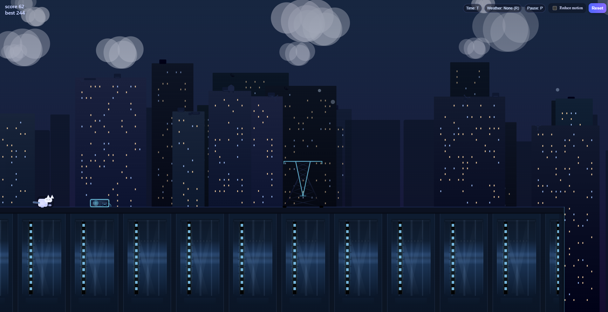
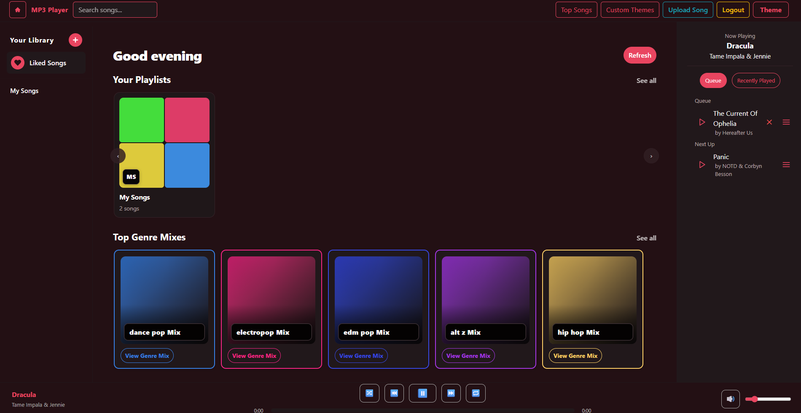
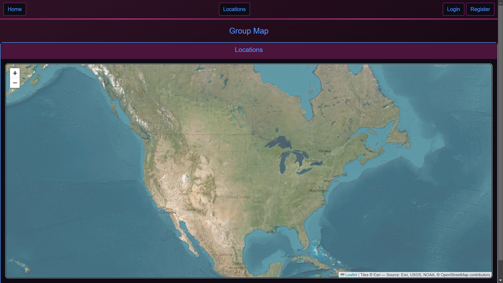
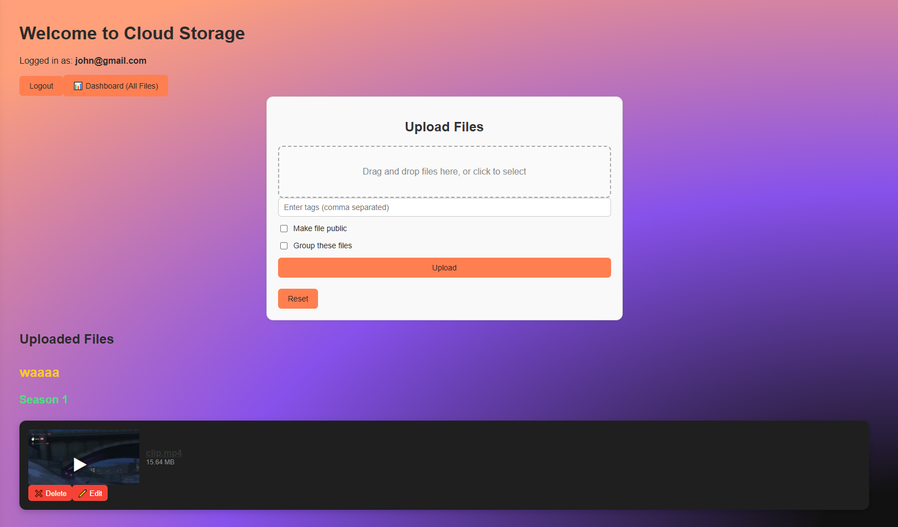

# Peyton's Portfolio

This is my personal portfolio website, built to showcase the kinds of projects I enjoy making, how I approach development, and where to find me.

[Live Link](https://portfolio-using-react-azat.onrender.com)

## Overview

I built this portfolio to have one place that reflects both my frontend focus and my full-stack development experience. It highlights the kinds of projects I like working on, gives a better sense of how I build, and makes it easy to explore my work.

The site includes:
- a hero section with my core stack and focus
- an about section with more context on how I approach development
- a projects section with previews and expandable project details
- a contact section for getting in touch

## Built With

- React
- Vite
- JavaScript
- CSS

## Features

- responsive portfolio layout
- project cards with preview thumbnails
- clickable images with a lightbox modal
- expandable project details for each project
- contact links for email and GitHub

## Featured Projects

### Rooftop Cat

A fast-paced rooftop endless runner inspired by the Chrome dinosaur game, built with a neon visual style and browser-based gameplay.

### Music App

A modern music app focused on playlist management, playback controls, and polished UI interactions.

### Location Tracking App

A full-stack location tracking app that lets users save locations, view them on an interactive map, and track movement over time.

### Cloud Storage App

A self-hosted cloud storage platform built around file uploads, organization, and custom file handling through the web.